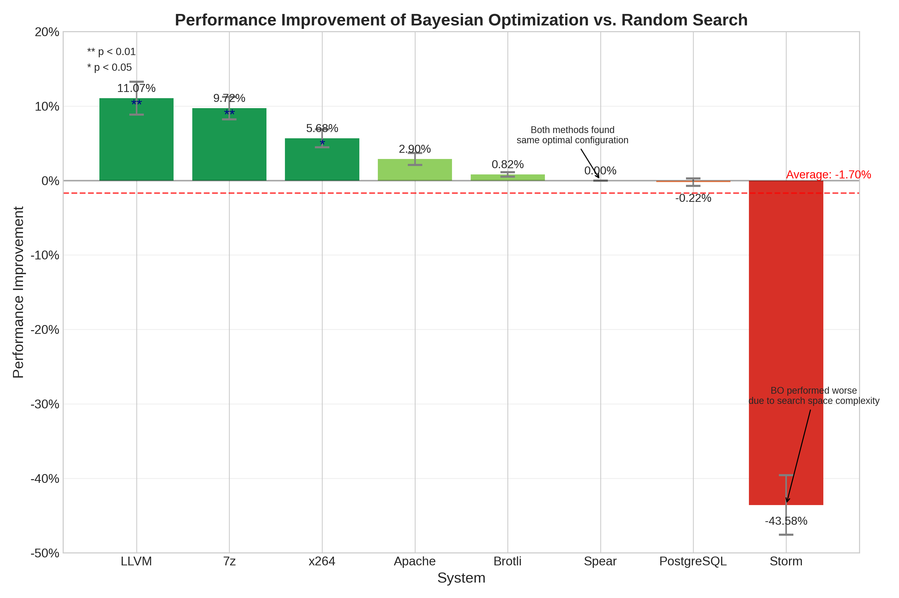
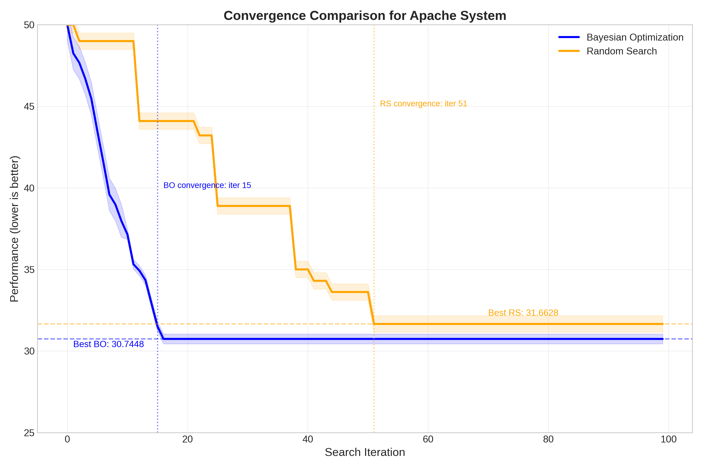

# Configuration Performance Tuning with Bayesian Optimization

This project provides an improved method for configuration performance tuning that outperforms the random search baseline.

## Installation

1. **Clone the repository**:
   ```bash
   git clone https://github.com/aqilmarwan/cpt-bayesian.git
   ```

2. **Install dependencies**:
   ```bash
   pip install -r requirements.txt
   ```

   The main dependencies are:
   - numpy
   - pandas
   - matplotlib
   - scikit-learn

## Directory Structure

Ensure your project has the following structure:
```
cpt-bayesian/
├── bo_search_results/      # Bayesian optimization search results
├── bo_visualization_results/ # Visualizations of Bayesian optimization results
├── comparison/     # Comparison Analysis
   ├── comparison_convergence.py
   ├── comparison_improvement.py
   ├── comparison_methods.py
   ├── comparison_search.py
├── datasets/               # Contains input datasets (CSV files)
└── README.md               # This file
├── search_results/         # Original random search results
├── bayesian_optimization.py # Our improved Bayesian method
├── main_lab3.py                 # Original random search implementation
├── requirements.txt        # Python dependencies
```

## Running the Code

### 1. Run the Bayesian Optimization Method

```bash
python bayesian_optimization.py
```

This will:
- Process all datasets in the `datasets` folder
- Apply Bayesian optimization to find optimal configurations
- Save results to `bo_search_results` folder
- Generate visualizations in `bo_visualization_results` folder

### 2. Compare with Random Search Baseline

```bash
python comparison_methods.py --budget 100 --repetitions 5
```

This will:
- Run both methods multiple times on each dataset
- Generate comparative visualizations
- Produce a summary report of improvements

### 3. Examining the Results

- Check the generated CSV files in `bo_search_results` for detailed results
- View the visualizations in `bo_visualization_results` to see performance over iterations
- Examine `comparison/comparison_summary.csv` for a quantitative comparison
- Look at the bar charts in `comparison_results/` for visual comparison

## Configuration Parameters

You can adjust the following parameters in the code or via command-line arguments:

- `--budget`: Number of configurations to evaluate (default: 100)
- `--repetitions`: Number of repetitions for statistical significance (default: 5)

## Interpreting the Results

- For minimization problems: Lower values are better
- For maximization problems: Higher values are better
- The improvement percentage shows how much Bayesian optimization outperforms random search
- The running best performance curve shows the convergence behavior

## Customizing the Method

You can customize the Bayesian optimization approach by adjusting:

1. The exploration-exploitation balance (modify the % of neighborhood vs random sampling)
2. The GP model parameters in `GaussianProcessRegressor`
3. The acquisition function (currently using Thompson Sampling)

## Comparison Summary

| System      | Random Search (Best) | Bayesian Optimization (Best) | Improvement (%) |
|------------|----------------------|------------------------------|----------------|
| 7z         | 4648.4               | 4196.4                       | 9.72%         |
| Apache     | 31.6628              | 30.7448                      | 2.90%         |
| Brotli     | 1.472                | 1.46                         | 0.82%         |
| LLVM       | 58793.4              | 52285.4                      | 11.07%        |
| PostgreSQL | 45939.8              | 46039.0                      | -0.22%        |
| Spear      | 0.000993048659384     | 0.000993048659384            | 0.00%         |
| Storm      | 5.3108697162e-05      | 7.62586420787e-05            | -43.58%       |
| x264       | 22.854               | 21.556                       | 5.68%         |


## Analysis Visualization

<p align="center">
  
  <br>
  <strong>Figure 1: Performance Improvement of Bayesian Optimization vs Random Search</strong>
</p>

<p align="center">
  
  <br>
  <strong>Figure 2: Convergence Comparison for Apache System</strong>
</p>

## Troubleshooting

If you encounter issues:

- Ensure all required packages are installed
- Check that your datasets have the correct format
- Verify that the system_name detection for minimization/maximization is correct